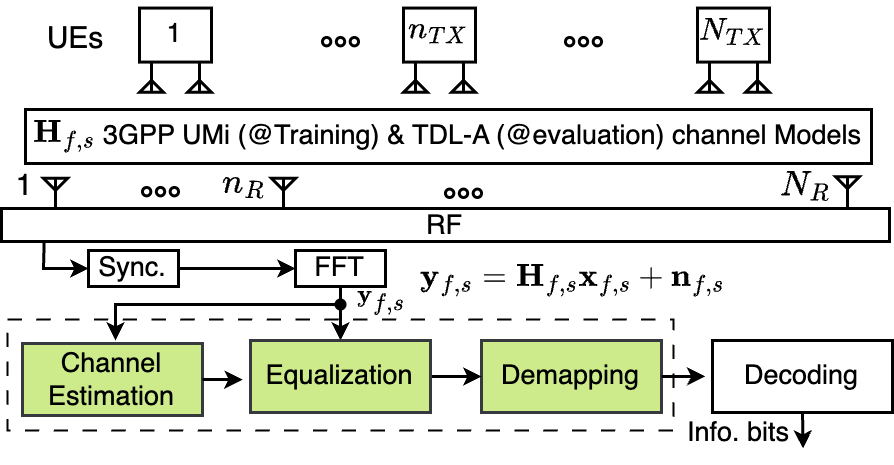
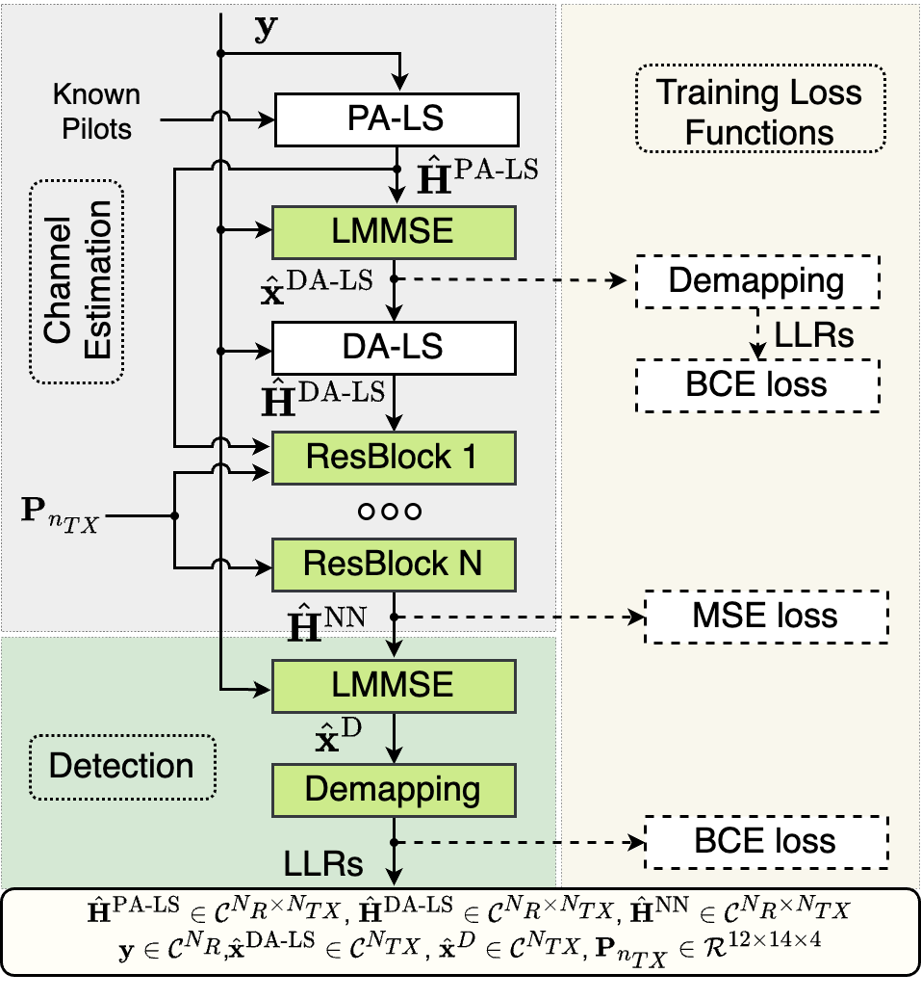
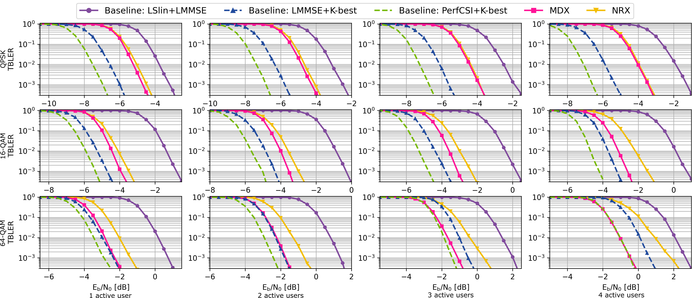

# A Compute&Memory Efficient Model-Driven Neural 5G Receiver (MDX) for Edge AI-assisted RAN
This repository implements a low-complexity, model-driven neural network-based receiver (MDX), designed for multi-user multiple-input multiple-output (MU-MIMO) systems and suitable for use at the RAN edge. The proposed solution is compliant with the 5G New Radio (5G NR), and supports different modulation schemes, bandwidths, number of users, and number of base-station antennas with a single trained model without the need for further training.

The underlying algorithm is described in detail in [MDX](https://arxiv.org/pdf/) [1]. Our implementation leverages the [NVIDIA® Sionna™ link-level simulation
library](https://nvlabs.github.io/sionna/), [Neural-Rx](https://github.com/NVlabs/neural_rx/) (NRX), and TensorFlow. It is fully compatible with TensorFlow's graph execution mode.

## Setup
Recomended setup:
- [Sionna 0.18](https://nvlabs.github.io/sionna/)
- TensorFlow 2.15
- [Jupyter](https://jupyter.org)
- Python 3.11
- Ubuntu 24.04
## Train MDX
Use the following command to train MDX model. You can change training/model parameters in `mdx/config/mdx_res_blocks2_var_mcs_it1_ext.cfg`.
``` bash
cd mdx/scripts
python3 ./train_neural_rx.py -system mdx -config_name mdx_res_blocks2_var_mcs_it1_ext.cfg -gpu 0
```
The directory `mdx/weights/` already includes the trained weights in [1].

## Evaluate MDX
You can evaluate a trained model named `config_name`, at channel type (e.g. TDL) `channel_type_eval`, TDL model (e.g. `["A", "B"]`) `tdl_models`, with bandwith `n_size_bwp_eval` (in number of PRBs), and batch size of `batch_size_eval`. Also you can choose algorithm to run ("mdx", "nrx", "baseline_lslin_lmmse", "baseline_lslin_kbest", "baseline_lmmse_kbest", "baseline_perf_csi_lmmse", "baseline_lmmse_lmmse", "baseline_perf_csi_kbest"). Additionaly you can add an extra label to the results file `name_suffix`.
```bash
cd mdx/scripts
python3 evaluate.py -num_tx_eval 1 -config_name="${config_name}" -gpu="${gpu}" -channel_type_eval="${channel_type_eval}" -tdl_models="${tdl_models}" -n_size_bwp_eval="${n_size_bwp_eval}" -batch_size_eval="${batch_size_eval}" -methods mdx -name_suffix="${name_suffix}"
```
more options with
```bash
python3 evaluate.py --help
```

The directories `mdx/eval_4x2_tdla`, `mdx/eval_16x4_tdla` contain evaluation scripts, result files, and Jupyter notebooks for visualizing the results. To run evaluation scripts do as following:
```bash
cd mdx/scripts
../eval_4x2_tdla/run_mdx_ext.sh
```

## System model
The communication system includes a 5G NR PUSCH receiver:
<p align="center"></p>

## Block Diagram of MDX
The colored blocks include trainable weights. The dashed blocks are used only in training.
<p align="center"></p>

## BLER Results
[<p align="center"></p>](eval_16x4_tdla/eval_16x4_tdla_prb273.ipynb)

## Complexity: FLOPs and Parameters
The table below compares the computational complexity (in Giga FLOPs) and model size (in thousands of parameters) for MDX and NRX models under different MIMO configurations.

| MIMO   | Model | FLOPs (G) | Params (k) | NRX/MDX              |
|--------|--------|------------|--------------|------------------------|
| 4×2    | MDX    | 0.7        | 2.7          | **106×** (FLOPs)       |
|        | NRX    | 78.6       | 431.2        | **157×** (Params)      |
| 16×4   | MDX    | 6.0        | 2.7          | **66×** (FLOPs)        |
|        | NRX    | 397.6      | 1088.4       | **396×** (Params)      |


## References

[1] M. Abdollahpour, M. Bertuletti, Y. Zhang, Y. Li, L. Benini, and A. Vanelli-Coralli, "[A Compute&Memory Efficient Model-Driven Neural 5G Receiver for Edge AI-assisted RAN](https://arxiv.org/pdf/)", GLOBECOM, Dec. 2025.


## License


# Citation

```
@software{mdx2025,
    title = {A Compute&Memory Efficient Model-Driven Neural 5G Receiver for Edge AI-assisted RAN},
    author = {Mahdi Abdollahpour, Marco Bertuletti, Yichao Zhang, Yawei Li, Luca Benini, Alessandro Vanelli-Coralli},
    note = {https://github.com/Mahdi-Abdollahpour/},
    year = 2025
}
```

# Acknowledgement


