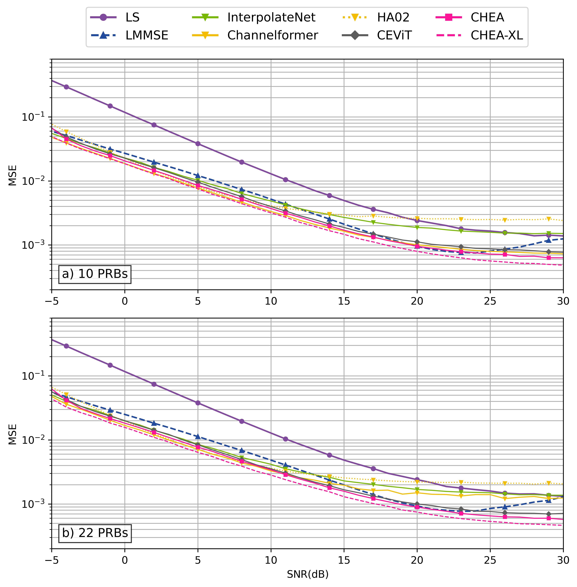
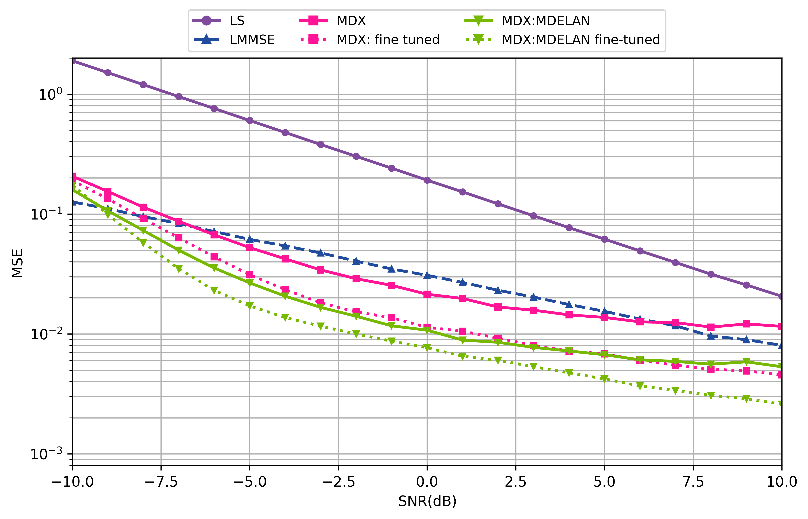
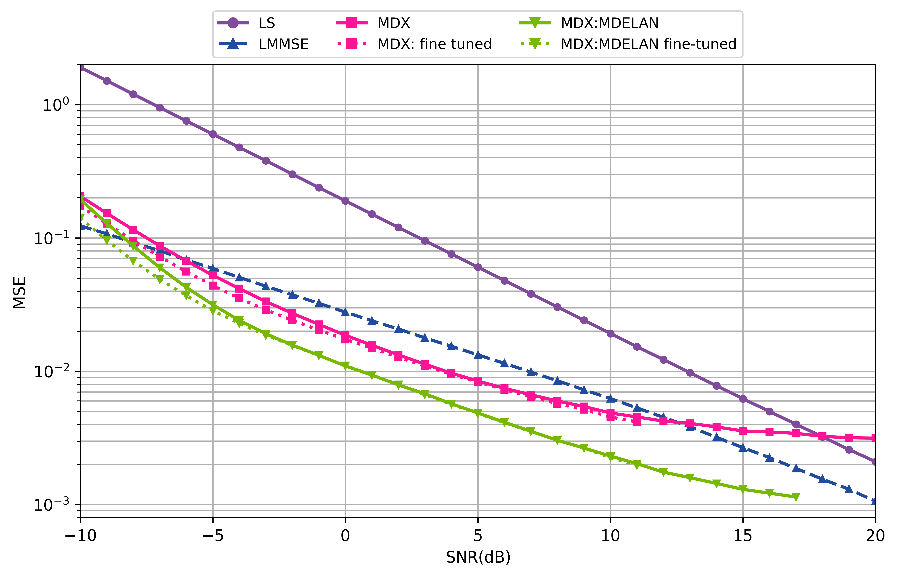
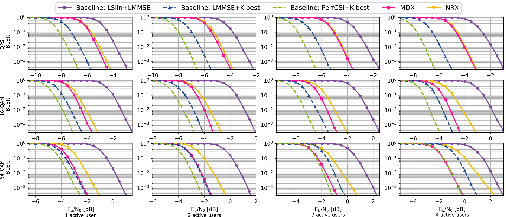
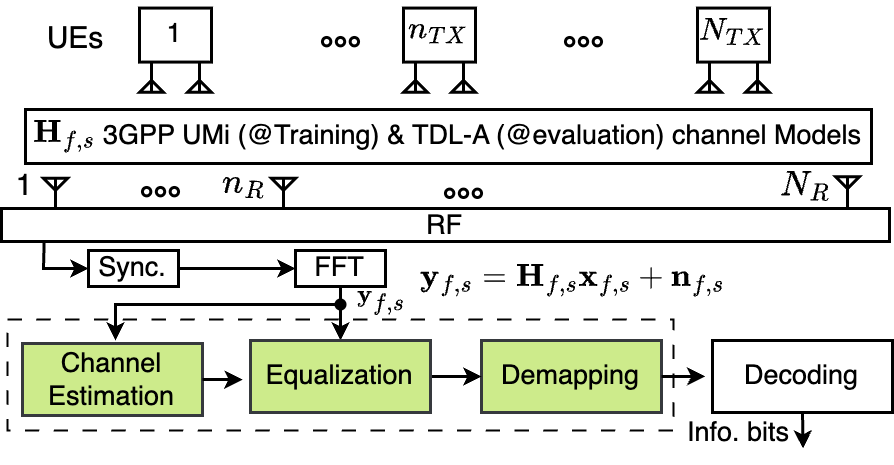
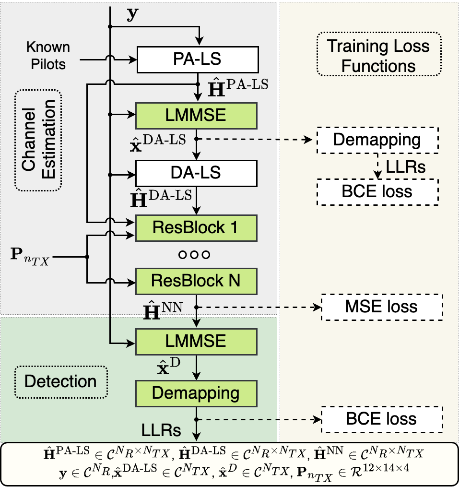

# MDX: Efficient Neural 5G NR Receivers and Channel Estimators

MDX is a TensorFlow/Sionna framework for designing, training and evaluating
low-complexity neural receivers and channel estimators for the 5G NR Physical
Uplink Shared Channel (PUSCH).

A receiver is described in a config file as a graph of blocks: classical
signal-processing blocks (LS and data-aided LS estimation, learnable LMMSE
equalization, demapping), neural blocks (ResNet, MDELAN, CHEA, attention and
CNN baselines) and training losses. New receiver architectures can therefore
be built, trained and benchmarked by editing a config file, without writing
model code; new blocks plug in with a one-line registration. The standard
compliant 5G NR PUSCH simulation (Sionna), the training loop and the
evaluation of BER/BLER and channel-estimation MSE against classical baselines
are provided.

The repository also contains the models, configurations, evaluation scripts
and results of the following papers:

| Paper | Venue | Models | Results |
|---|---|---|---|
| [A Compute&Memory Efficient Model-Driven Neural 5G Receiver for Edge AI-assisted RAN](https://arxiv.org/abs/2508.12892) [1] | IEEE GLOBECOM 2025 | MDX | [`evals/MDX_GLOBECOM2025`](evals/MDX_GLOBECOM2025) |
| [On-board AI-based Channel Estimation for LEO NTNs](https://arxiv.org/abs/2607.15127) [2] | IEEE SPAWC 2026 | MDX, MDX:MDELAN | [`evals/MDELAN_SPAWC2026`](evals/MDELAN_SPAWC2026) |
| [Scalable Attention for 5G NR Channel Estimation](https://arxiv.org/abs/2607.16462) [3] | IEEE PIMRC 2026 Workshops | CHEA, CHEA-XL | [`evals/CHEA`](evals/CHEA) |

The code builds on the [NVIDIA® Sionna™ link-level simulation library](https://nvlabs.github.io/sionna/)
and [neural_rx](https://github.com/NVlabs/neural_rx) (NRX), and runs in
TensorFlow graph/XLA mode.

**Coming next:** CELERE, a new channel estimator currently under development,
will be added in a future release.

> The previous version of this repository (MDX, GLOBECOM 2025 only) is
> available under the tag `v0`.

## Receivers as config files

Each file in `config/` defines the 5G NR system (bandwidth, antennas, MCS,
DMRS), the training schedule and, in `block_config`, the receiver itself. The
blocks run in order on the LS channel estimate of every antenna-user link,
a tensor of shape `[batch*num_tx*num_rx_ant, num_subcarriers, num_ofdm_symbols, 2]`
(real and imaginary parts), and each block selects its inputs with `feeds`:

- `-1` is the previous output, `0` the LS estimate and `"@name"` the output
  of a named block; a list such as `[0, "@ls"]` passes several inputs.
- `"$rx_signal"`, `"$noise"`, `"$pilot_mask"`, `"$mcs_masks"` and `"$shapes"`
  are provided by the receiver (received grid, noise and error variances,
  pilot positions, MCS of each user, tensor sizes).
- `"save": "channel"` marks the refined channel estimate and
  `"save": "llr"` the LLRs passed to the LDPC decoder.
- Blocks whose type ends in `Loss` compare their input with a `target`
  (`"channel_ofdm"` or `"bits"`); their sum is the training loss.

For example, CHEA [3] is a channel estimator trained with a random number of
allocated PRBs (`config/chea16d.cfg`):

```python
block_config = [
    {"type": "PRBdrop", "feeds": [-1, "$shapes"], "min_len": 12, "name": "prb_mask"},
    {"type": "CHEAStack", "feeds": [[0, "@prb_mask"]], "d_model": 16,
     "pilot_stride": 1, "patch_size": 12, "num_stages": 2,
     "name": "chea_stack", "save": "channel"},
    {"type": "ChLoss", "feeds": [[-1, "@prb_mask"], "$noise", "$shapes"],
     "target": "channel_ofdm", "loss_type": "huber", "delta": 1., "name": "ch_loss"},
]
```

and the MDX receiver of [2] combines learnable LMMSE equalization, data-aided
LS estimation, a ResNet refinement and demapping (`config/mdx_ntn.cfg`):

```python
block_config = [
    {"type": "LMMSE", "feeds": [-1, "$rx_signal", "$noise", "$mcs_masks", "$shapes"],
     "noise_inx": 2, "noise_outx": 0, "mcs_x": 1, "name": "lmmse0"},
    {"type": "BDemapper", "feeds": ["@lmmse0", "$mcs_masks"], "name": "demapper0"},
    {"type": "LLRLoss", "feeds": [-1, "$mcs_masks", "$noise", "$shapes"], "target": "bits",
     "lambda_tot": 1, "snr_weighting": True, "name": "llr_loss0"},
    {"type": "LS", "feeds": [[0, "@lmmse0"], "$rx_signal", "$pilot_mask", "$shapes"],
     "num_tx": 1, "name": "ls"},
    {"type": "Concat", "feeds": [[0, "@ls"]], "name": "cat1"},
    {"type": "ResNet", "num_blocks": 5, "pos_prbs": 3, "use_res_weight": True,
     "block_type": "Conv", "block_config": {"filters_in": -1, "filters": 8, "groups": -1},
     "feeds": ["@cat1"], "name": "resnet"},
    {"type": "Conv", "filters_in": -1, "filters": 2, "groups": -1, "norm": False, "act": False,
     "feeds": ["@resnet"], "name": "head", "save": "channel"},
    {"type": "ChLoss", "feeds": ["@head", "$noise", "$shapes"], "target": "channel_ofdm",
     "lambda_tot": 1.0, "snr_weighting": False, "time_steps": "all",
     "loss_type": "mse", "delta": 1.0, "name": "ch_loss"},
    {"type": "LMMSE", "feeds": ["@head", "$rx_signal", "$noise", "$mcs_masks", "$shapes"],
     "noise_inx": 2, "noise_outx": 2, "mcs_x": 1, "name": "lmmse"},
    {"type": "BDemapper", "feeds": ["@lmmse", "$mcs_masks"], "name": "demapper", "save": "llr"},
    {"type": "LLRLoss", "feeds": [-1, "$mcs_masks", "$noise", "$shapes"], "target": "bits",
     "lambda_tot": 0., "snr_weighting": False, "name": "llr_loss", "save": True},
]
```

The MDX:MDELAN model of [2] (`config/mdx_ntn_mdelan2f.cfg`) only changes the
`ResNet` entry:

```python
    {"type": "ResNet", "num_blocks": 2, "pos_prbs": 3, "use_res_weight": True,
     "block_type": "MDELAN",
     "block_config": {"filters_in": -1, "filters": 8, "dilation": (2, 4, 8), "min_filters": 2,
                      "groups": -1, "expansion": .5, "light": True},
     "feeds": ["@cat1"], "name": "resnet"},
```

Available blocks include:

| Block | Purpose |
|---|---|
| `LS` | data-aided LS channel estimation with interference cancellation |
| `LMMSE` | LMMSE equalization with learnable per-PRB error-variance scaling |
| `BDemapper` | soft demapping to LLRs, per MCS |
| `ResNet`, `ResBlock` | residual stacks of `Conv`, `MDELAN` or `Bottleneck` blocks with per-PRB residual weights and positional encodings |
| `Conv`, `MDELAN`, `C2f`, `Bottleneck` | convolutional blocks (depthwise-separable with `"groups": -1`) |
| `CHEAStack` | CHEA multi-resolution windowed attention estimator |
| `InterpolationResNet`, `HA02`, `Channelformer`, `CEViT` | baseline channel estimators of [3] |
| `PRBdrop` | random PRB-allocation masking for bandwidth-agnostic training |
| `Concat`, `StopGradients`, `HFreqNormalizer` | utilities |
| `ChLoss`, `LLRLoss` | MSE/Huber loss on channel estimates, BCE loss on LLRs |

### Adding your own block

Put a Keras layer in `blocks/`, register it, and import the file in
`blocks/__init__.py`:

```python
# blocks/my_denoiser.py
import tensorflow as tf
from .registry import register_block


@register_block
class MyDenoiser(tf.keras.layers.Layer):
    """Residual CNN that refines the LS channel estimate."""

    def __init__(self, filters=16, **kwargs):
        super().__init__(**kwargs)
        self.conv1 = tf.keras.layers.SeparableConv2D(filters, 3, padding="same", activation="relu")
        self.conv2 = tf.keras.layers.SeparableConv2D(2, 3, padding="same")

    def call(self, x, training=False):
        # x: [batch*num_tx*num_rx_ant, num_subcarriers, num_ofdm_symbols, 2]
        return x + self.conv2(self.conv1(x))
```

It can then be used in any config (copy for instance `config/chea16d.cfg`,
change its `label` and `block_config`):

```python
block_config = [
    {"type": "MyDenoiser", "filters": 16, "name": "denoiser", "save": "channel"},
    {"type": "ChLoss", "feeds": ["@denoiser", "$noise", "$shapes"],
     "target": "channel_ofdm", "loss_type": "mse", "name": "ch_loss"},
]
```

and trained and evaluated like the models of the papers
(`-system deep_echo` / `-methods deep_echo`, see below). Blocks receive the
requested `"$..."` inputs as keyword arguments, and loss blocks the selected
target as second argument.

### Configs

| Config | Model | Paper |
|---|---|---|
| `mdx_res_blocks2_var_mcs_it1_ext.cfg`, `mdx_res_blocks2_var_mcs_it1_ext_eval16x4.cfg` | MDX, original receiver (`receivers/md_rx.py`, method `mdx`) | [1] |
| `nrx_large_*.cfg`, `baselines_4x2.cfg`, `baselines_16x4.cfg`, `mdx_var_mcs_BSL_LMMSE_16x4_mcs*.cfg` | NRX and classical baselines | [1] |
| `mdx_ntn.cfg`, `mdx_ntn_frural.cfg`, `mdx_ntn_fsuburban.cfg` | MDX as a block graph for LEO NTN, and its rural / suburban fine-tuned versions | [2] |
| `mdx_ntn_mdelan2f.cfg`, `mdx_ntn_mdelan2f_frural.cfg`, `mdx_ntn_mdelan2f_fsuburban.cfg` | MDX:MDELAN, and its fine-tuned versions | [2] |
| `baselines_2x1.cfg` | LS and LMMSE baselines | [2] |
| `chea16d.cfg`, `chea64.cfg` | CHEA and CHEA-XL | [3] |
| `interpnet*.cfg`, `ha02_*.cfg`, `channelformer*.cfg`, `cevit*.cfg`, `baselines_4x2_chea.cfg` | InterpolateNet, HA02, Channelformer, CEViT, LS and LMMSE baselines (10 and 22 PRBs) | [3] |
| `mdx.cfg` | **Template** (not a paper model, no trained weights): MDX as a block graph for a terrestrial 4x2 MU-MIMO setup with MCS 9/14/19, trained on UMi; a starting point for new receivers | – |

## Models

- **MDX** [1]: a model-driven MU-MIMO receiver. Pilot-aided and data-aided LS
  channel estimates are refined by depthwise-separable ResBlocks with per-PRB
  residual weights; LMMSE equalization and demapping use learnable per-PRB
  error-variance matrices. A single trained model supports different
  modulation orders, bandwidths, numbers of users and receive antennas.
- **MDX:MDELAN** [2]: MDX used as a channel estimator for LEO non-terrestrial
  networks, where the ResBlocks are replaced by *Multi-Dilated Efficient Layer
  Aggregation Network* (MDELAN) blocks: progressively dilated
  depthwise-separable convolutions with ELAN-style aggregation.
- **CHEA** [3]: *Channel Estimation Attention*, a multi-resolution windowed
  transformer. A high-resolution encoder keeps local pilot detail, a
  low-resolution encoder captures wider frequency context, and a local
  cross-attention decoder transfers the coarse context back to the pilot
  tokens; a per-PRB linear layer reconstructs the full slot. All attention is
  confined to fixed-size windows, so complexity grows linearly with the number
  of subcarriers and one trained model serves any PRB allocation.
- **Baselines**: LS, LMMSE and K-best detection (Sionna), NVIDIA NRX, and
  TensorFlow re-implementations of InterpolateNet, HA02, Channelformer and
  CEViT (`blocks/`) used in [3].

Graph-based models (MDX and MDX:MDELAN of [2], CHEA and the neural
baselines of [3]) are assembled from the `block_config` of a config file by
`graphs/block_graph.py` and run inside the `DeepEcho5G` PUSCH receiver
(`receivers/deep_echo.py`, method `deep_echo`).

The MDX receiver of [1] is the original implementation in
`receivers/md_rx.py` (method `mdx`), configured by
`config/mdx_res_blocks2_var_mcs_it1_ext*.cfg`. Its trained weights are in
`weights/`, so the GLOBECOM 2025 results can be regenerated directly with the
scripts in `evals/MDX_GLOBECOM2025`.

## Repository layout

```
blocks/      neural blocks (CHEA, MDELAN, ResNet, LMMSE/demapper/LS, baselines)
graphs/      config-driven block graph (ModularGraph)
receivers/   PUSCH receivers: MDX (md_rx.py), DeepEcho5G (deep_echo.py), K-best variants
core/        runtime settings
utils/       metrics, weight loading, plotting helpers
ext/neural_rx/  modified copy of NVIDIA neural_rx (system model, training loop, baselines)
ext/sionna/     Sionna 0.19.2 with small channel-model extensions (git submodule)
scripts/     training and evaluation entry points
config/      configurations of all models used in the papers
evals/       evaluation scripts, result files and notebooks per paper
weights/     trained weights
```

## Setup

Recommended: Ubuntu 22.04, Python 3.10, TensorFlow 2.15, an NVIDIA GPU.

```bash
git clone --recursive https://github.com/Mahdi-Abdollahpour/mdx.git
cd mdx
python -m venv .venv && source .venv/bin/activate
pip install -r requirements.txt
pip install -e ext/sionna
```

If you cloned without `--recursive`, run `git submodule update --init`.

## Training

All entry points are run from `scripts/`; configs are looked up in `config/`
and weights are written to `weights/<label>_weights.h5`.

```bash
cd scripts
# CHEA (trained once with a random number of PRBs, 1 to 24)
python train_neural_rx.py -system deep_echo -config_name chea16d.cfg -gpu 0
# MDX as a block-graph config, for LEO NTN (needs the NTN channel datasets, see below)
python train_neural_rx.py -system deep_echo -config_name mdx_ntn.cfg -gpu 0
# MDX:MDELAN for LEO NTN
python train_neural_rx.py -system deep_echo -config_name mdx_ntn_mdelan2f.cfg -gpu 0
# original MDX receiver of [1] (receivers/md_rx.py), GLOBECOM 2025 setup
python train_neural_rx.py -system mdx -config_name mdx_res_blocks2_var_mcs_it1_ext.cfg -gpu 0
# MDX block-graph template for a terrestrial 4x2 MU-MIMO setup (not a paper model)
python train_neural_rx.py -system deep_echo -config_name mdx.cfg -gpu 0
```

## Evaluation

`scripts/evaluate_metrics.py` computes BER/BLER and/or channel-estimation MSE
(`-eval_mode`) for the selected methods (`-methods deep_echo mdx nrx
baseline_lslin_lmmse baseline_lmmse_lmmse ...`); see
`python evaluate_metrics.py --help`. Each folder in `evals/` contains the
scripts that produced the result files of a paper and a notebook that plots
the paper figures from them.

| Paper | Run | Plot |
|---|---|---|
| [1] | `evals/MDX_GLOBECOM2025/eval_4x2_tdla/*.sh`, `evals/MDX_GLOBECOM2025/eval_16x4_tdla/*.sh` | `eval_4x2_tdla_prb273.ipynb`, `eval_16x4_tdla_prb273.ipynb` |
| [2] | `evals/MDELAN_SPAWC2026/run_rural.sh`, `run_suburban.sh` | `eval_2x1_ntn_rural.ipynb`, `eval_2x1_ntn_suburban.ipynb` |
| [3] | `evals/CHEA/tdla/run.sh` | `evals/CHEA/tdla/nb_chea.ipynb` |

For example, to re-run the CHEA evaluation on GPU 0 and re-plot Fig. 3:

```bash
evals/CHEA/tdla/run.sh -gpu 0
jupyter nbconvert --to notebook --execute evals/CHEA/tdla/nb_chea.ipynb
```

The LMMSE baselines need channel covariance matrices; `evaluate_metrics.py`
computes and caches them in `weights/` on first use.

### LEO NTN datasets

The NTN experiments [2] use channel realizations generated with the
QuaDRiGa NTN extension (S-band, LEO-600 satellite, handheld UE; dense urban
and urban for training, rural and suburban for testing). The configs expect
them as MATLAB v7.3 files in `data/` (e.g. `data/leo_ntn_channels_v73_train.mat`).

## Results

### CHEA: MSE on TDL-A with 10 and 22 PRBs [3]

<p align="center"></p>

| Model | MACs per link | Parameters |
|---|---|---|
| HA02 | 68F² + 312F | 20F² + 28F + 55 |
| Channelformer | 344F² + 52,296F | 18F² + 28F + 22,381 |
| CEViT | 28F² + 68,700F | 45F + 203,730 |
| InterpolateNet | 61,776F | 56F + 5,410 |
| **CHEA** | **6,496F** | **36 K** |
| **CHEA-XL** | **65,984F** | **274 K** |

F is the number of subcarriers.

### MDX:MDELAN: MSE in LEO NTN rural and suburban scenarios [2]

<p align="center">


</p>

### MDX: TBLER on TDL-A, 273 PRBs [1]

<p align="center"></p>

| MIMO | Model | FLOPs (G) | Params (k) | NRX/MDX |
|---|---|---|---|---|
| 4×2 | MDX | 0.7 | 2.7 | **106×** (FLOPs) |
| | NRX | 78.6 | 431.2 | **157×** (Params) |
| 16×4 | MDX | 6.0 | 2.7 | **66×** (FLOPs) |
| | NRX | 397.6 | 1088.4 | **396×** (Params) |

System model and MDX block diagram:

<p align="center"></p>
<p align="center"></p>

## Trained weights

`weights/` contains the MDX weights of [1] and the NRX baselines used there.
The evaluation scripts load `weights/<label>_weights.h5`, where `<label>` is
the `label` of the config file (e.g. `weights/chea16d_weights.h5`).

## References

[1] M. Abdollahpour, M. Bertuletti, Y. Zhang, Y. Li, L. Benini, and A. Vanelli-Coralli,
"A Compute&Memory Efficient Model-Driven Neural 5G Receiver for Edge AI-assisted RAN,"
IEEE GLOBECOM, 2025. [arXiv:2508.12892](https://arxiv.org/abs/2508.12892)

[2] M. Abdollahpour, B. De Filippo, C. Amatetti, and A. Vanelli-Coralli,
"On-board AI-based Channel Estimation for LEO NTNs," IEEE SPAWC, 2026.
[arXiv:2607.15127](https://arxiv.org/abs/2607.15127)

[3] M. Abdollahpour, M. Bertuletti, Y. Zhang, L. Benini, and A. Vanelli-Coralli,
"Scalable Attention for 5G NR Channel Estimation," IEEE PIMRC Workshops, 2026.
[arXiv:2607.16462](https://arxiv.org/abs/2607.16462)

## Citation

If you use this code, please cite the repository and the papers of the
models you use:

```bibtex
@software{mahdi2026mdxrepo,
  title   = {{MDX}: Efficient Neural {5G NR} Receivers and Channel Estimators},
  author  = {Abdollahpour, Mahdi},
  year    = {2026},
  version = {v1},
  url     = {https://github.com/Mahdi-Abdollahpour/mdx}
}

@inproceedings{mahdi2025mdx,
  title     = {A Compute\&Memory Efficient Model-Driven Neural 5G Receiver for Edge AI-assisted RAN},
  author    = {Abdollahpour, Mahdi and Bertuletti, Marco and Zhang, Yichao and Li, Yawei and Benini, Luca and Vanelli-Coralli, Alessandro},
  booktitle = {IEEE Global Communications Conference (GLOBECOM)},
  year      = {2025},
  eprint    = {2508.12892},
  archivePrefix = {arXiv},
  url       = {https://arxiv.org/abs/2508.12892}
}

@inproceedings{mahdi2026ntn,
  title     = {On-board AI-based Channel Estimation for LEO NTNs},
  author    = {Abdollahpour, Mahdi and De Filippo, Bruno and Amatetti, Carla and Vanelli-Coralli, Alessandro},
  booktitle = {IEEE International Workshop on Signal Processing Advances in Wireless Communications (SPAWC)},
  year      = {2026},
  eprint    = {2607.15127},
  archivePrefix = {arXiv},
  url       = {https://arxiv.org/abs/2607.15127}
}

@inproceedings{mahdi2026chea,
  title     = {Scalable Attention for 5G NR Channel Estimation},
  author    = {Abdollahpour, Mahdi and Bertuletti, Marco and Zhang, Yichao and Benini, Luca and Vanelli-Coralli, Alessandro},
  booktitle = {IEEE International Symposium on Personal, Indoor and Mobile Radio Communications (PIMRC) Workshops},
  year      = {2026},
  eprint    = {2607.16462},
  archivePrefix = {arXiv},
  url       = {https://arxiv.org/abs/2607.16462}
}
```

## License

This project is a derivative of NVIDIA's neural_rx and is distributed under
the NVIDIA License (non-commercial, research and evaluation use only); see
[`LICENSE.txt`](LICENSE.txt). Sionna is licensed under Apache-2.0. The
InterpolateNet, HA02, Channelformer and CEViT blocks are re-implementations
of the cited third-party works for benchmarking purposes.

## Acknowledgements

This work was supported by a grant from the Swiss National Supercomputing
Centre (CSCS) under project ID lp12 on Alps, and by the UNITY-6G project,
which received funding from the Smart Networks and Services Joint Undertaking
(SNS JU) under the European Union's Horizon Europe research and innovation
programme under Grant Agreement No 101192650.
